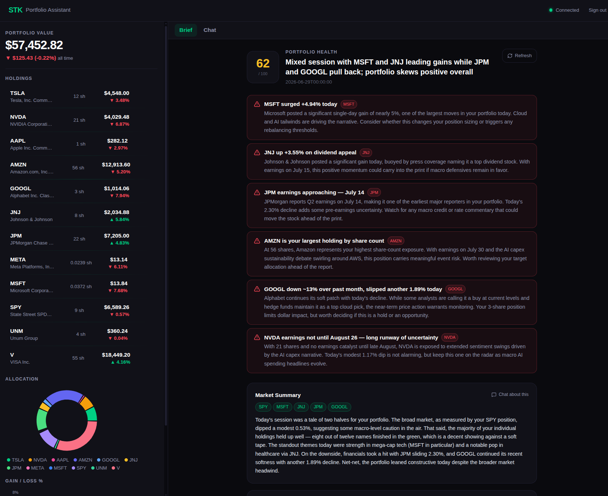
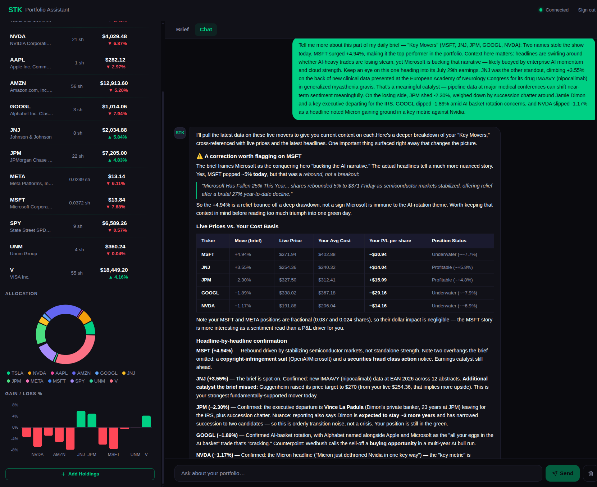
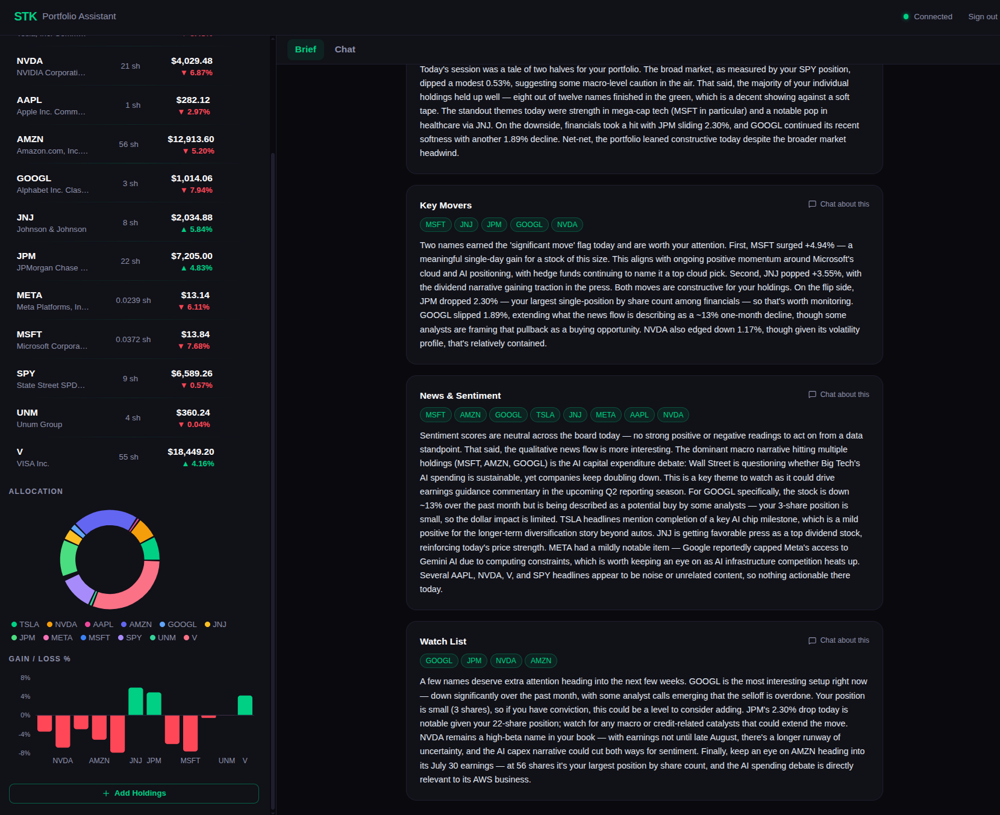
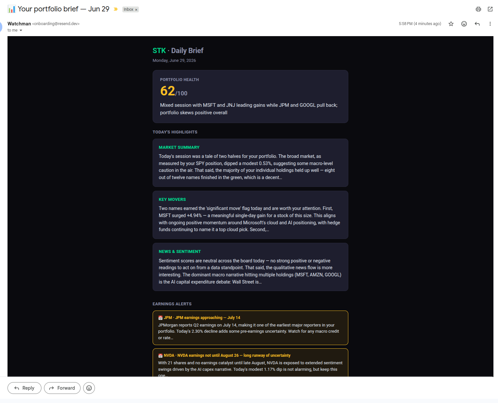

# STK Portfolio Assistant

An AI portfolio assistant that pairs a conversational agent with a proactive daily brief. Ask questions about your holdings and get answers backed by live data — or open the Brief tab each morning for a portfolio rundown generated overnight by [Watchman](https://github.com/rosmitg/watchman).

[](https://stk-frontend-512165788990.australia-southeast1.run.app)
[](https://github.com/rosmitg/stk-portfolio-assistant)

---

## Demo

**Live:** https://stk-frontend-512165788990.australia-southeast1.run.app

Sign up with email/password (Supabase auth). An **Alpaca paper trading account is pre-connected for the demo**, so you can sync a sample portfolio and start chatting without wiring up your own broker keys.

---

## What it does

STK is an AI portfolio assistant with two modes. The **Chat** tab runs a LangChain agent that reaches for live prices, news, portfolio maths, or research documents depending on what you ask. The **Brief** tab surfaces a personalised daily portfolio brief — health score, themed sections, and ticker-tagged insights — produced by Watchman, the background intelligence engine that watches your holdings while you're away.

---

## Features

- **Conversational agent** — LangChain `AgentExecutor` with four tools: live prices (Alpaca → yfinance fallback), news search (NewsAPI), a portfolio calculator (P&L, allocation, sector breakdown), and RAG search over ingested research.
- **Daily portfolio brief** — generated by Watchman's five LangGraph agents (news, fundamentals, sentiment, SEC filings, synthesis) and rendered in the Brief tab.
- **Real-time alerts** — earnings dates, concentration risk, and notable price moves across your holdings.
- **Email delivery** — the daily brief is sent to your inbox via Resend.
- **Authentication & persistence** — Supabase email/password auth with per-user portfolio storage.
- **LangSmith evaluations** — 0.81 relevance score (LLM-as-judge), 17 passing tests across agent tools and API routes.

---

## Screenshots

**Daily Brief**


**Portfolio Chat**



**Email Delivery**


---

## Architecture

```
                          ┌─────────────────────┐
   User ───► React SPA ──►│   STK Backend       │
            (Vite)        │   (FastAPI)         │
                          │                     │
                          │  LangChain Agent    │
                          │  ├ ticker_info      │
                          │  ├ news_search      │
                          │  ├ portfolio_calc   │
                          │  └ rag_search       │
                          └──────────┬──────────┘
                                     │
                                     ▼
                          ┌─────────────────────┐
                          │  Shared PostgreSQL  │
                          │  (Cloud SQL)        │
                          │  holdings · briefs  │
                          └──────────┬──────────┘
                                     ▲
                                     │ reads holdings · writes briefs
                          ┌──────────┴──────────┐
                          │  Watchman Backend   │      ┌──────────┐
                          │  (LangGraph, 5      │ ───► │  Email   │
                          │   agents + sched.)  │      │ (Resend) │
                          └─────────────────────┘      └──────────┘
```

STK and Watchman are separate services that share a single PostgreSQL database. STK owns chat and serves the Brief tab; Watchman runs on a schedule, reads each user's holdings, generates the brief, writes it back, and emails it.

---

## Tech stack

| Frontend | Backend | Agents / LLM | Infrastructure |
|---|---|---|---|
| React 18 | FastAPI | LangChain `AgentExecutor` | GCP Cloud Run |
| TypeScript | Python 3.11 | Claude API (`claude-sonnet-4-5`) | Cloud SQL (PostgreSQL) |
| Tailwind CSS | SQLAlchemy (async) | ChromaDB + Voyage AI (RAG) | Secret Manager |
| Recharts | asyncpg | LangSmith (tracing + evals) | Cloud Build |
| Vite | Supabase auth (JWT) | Watchman (LangGraph brief engine) | Artifact Registry |

---

## Powered by Watchman

The Brief tab is backed by **[Watchman](https://github.com/rosmitg/watchman)**, a standalone multi-agent intelligence engine. Where STK answers questions on demand, Watchman is proactive: it runs a five-agent LangGraph pipeline against your holdings each morning — pulling news, fundamentals, sentiment, and SEC filings, then synthesising them into a single brief with Claude. The two systems share one PostgreSQL database, so STK simply reads the brief Watchman has already written. See the [Watchman repository](https://github.com/rosmitg/watchman) for the agent internals.

---

## Local development

**Prerequisites:** Python 3.11+, Node 20+, Docker (or a local Postgres).

```bash
# Backend
cd backend
python -m venv .venv && source .venv/bin/activate
pip install -r requirements.txt
cp .env.example .env   # ANTHROPIC_API_KEY, VOYAGE_API_KEY, NEWS_API_KEY,
                       # ALPACA_API_KEY, ALPACA_SECRET_KEY, DATABASE_URL,
                       # SUPABASE_URL, SUPABASE_SERVICE_KEY
uvicorn app.main:app --reload --port 8000
```

```bash
# Frontend
cd frontend-react
cp .env.example .env   # VITE_BACKEND_URL, VITE_SUPABASE_URL, VITE_SUPABASE_ANON_KEY
npm install
npm run dev
```

```bash
# Tests
cd backend && pytest tests/ -v
```

---

## Evaluation

Evals run through LangSmith against a fixed question set covering price lookups, portfolio questions, and general market queries.

- **Relevance score: 0.81** (LLM-as-judge, 0–1 scale)
- **17 passing tests** across agent tools and API routes
